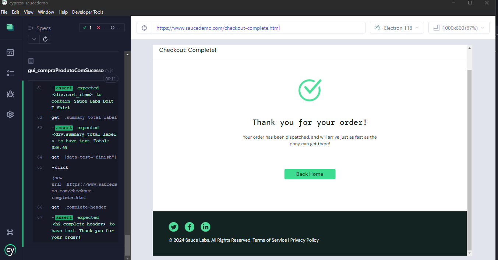

#   Automação WEb do site Saucedemo

Repositório criado para ilustrar uma automação E2E em Cypress no website Saucedemo 🔗[link](https://www.saucedemo.com/).</br>
Fiz uma automação desde o login do usuário, escolha e compra de produtos até o checkout.
 

<video src=".github/Cypress_saucedemo.mp4" width="640" height="480" controls></video>


## 🛠️  Instalações necessárias

- Instale o node.js [aqui](https://nodejs.org/en/download/)
- Para iniciar o projeto digite no cmd

```bash
   npm init -y
   ```

- Instale o Cypress via npm  [documentação](https://docs.cypress.io/guides/overview/why-cypress)
- Entre na pasta do seu projeto 

```bash
   cd /your/project/path
   ```

- E digite o comando abaixo:


```bash
   npm install cypress -D
   ```

   - Digite o seguinte comando para abrir o Cypress:

```bash
   npx cypress open
   ```
- Uma janela com o Cypress será aberta então clique no botão E2E TESTING 
- Depois escolha o browser. Eu usei o Electron.

## Requisitos do sistema


- macOS 10.15 e superior (Intel ou Apple Silicon 64 bits (x64 ou arm64))
- Linux Ubuntu 20.04 e superior, Fedora 38 e superior, e Debian 10 e superior (x64 ou arm64) (consulte os pré-requisitos do Linux abaixo)
- Windows 10 e superior (apenas 64 bits)
- O Cypress requer o Node.js para instalação. Nós damos suporte às versões:Node.js 18.x, Node.js 20.x e posteriores


## Entre em contato

 <a href="https://www.linkedin.com/in/amandaoliveira--/" target="_blank"></a>
<a href="http://discordapp.com/users/Amandatec#4699" target="_blank"></a>
  <a href="https://www.instagram.com/amanda_almajor/" target="_blank"></a>
  <a href = "mailto:amandatec.oliveira@gmail.com"></a>

 Made by [**Amandatec**](https://www.linkedin.com/in/amandaoliveira--/)
